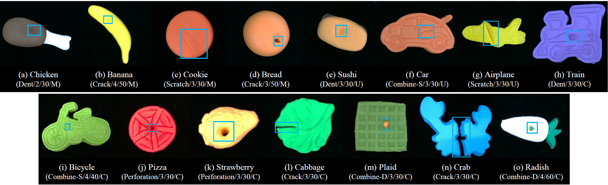

# PD-REAL
This repo. contains our dataset, PD-REAL, for 3D anomaly detection.

PD-REAL consists of over 3,500 high-resolution RGB images and the corresponding depth images and point clouds with 15 object categories, which can be grouped as follows: 

Food: *chicken, cookie, bread, sushi, pizza*     
Vegetables: *cabbage, radish*      
Fruits: *banana, strawberry*     
Toys: *car, airplane, train, bicycle, plaid, crab*        

All the objects in PD-REAL are made of Play-Doh models, with 6 types of mannualy introduced anomaly types: *dent, crack, perforation, scratch, combine-S, combine-D*.

Please access PD-REAL from the following link: https://drive.google.com/file/d/1Me3kGLC1T-o5Zk3Tg55kthfmrffoQObF/view?usp=drive_link

